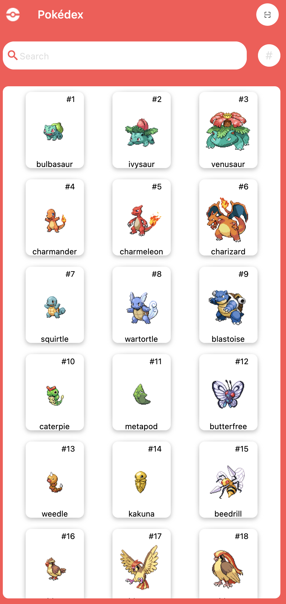

# pokeapi

A flutter app that uses the [PokeAPI](https://pokeapi.co/) to display information about Pokémon.

## Pokémon Info App
This is a Flutter application that uses the PokeAPI to display information about Pokémon.

## Features
- Fetch and display a list of Pokémon from the PokeAPI.
- Show detailed information about each Pokémon when selected from the list.

## Screenshots
Here is a screenshot of the home screen:

